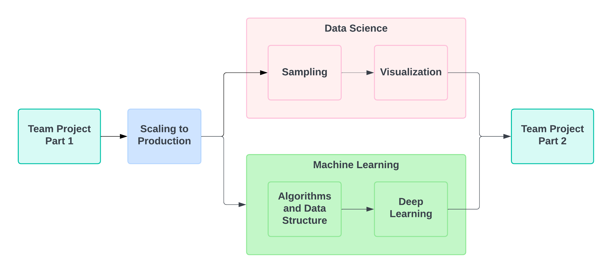

# Team Project
```
$ echo "Data Sciences Institute"
```

---

# FAQs From Yesterday

What is the timeline of the team project?



---

# FAQs From Yesterday

**Teams are final.**

If any of your team members are in a different stream (ie. Data Science vs. Machine Learning), let us know! 

---

# FAQs From Yesterday

***Enter your team's dataset and business case in the provided spreadsheet.***

---

# FAQs From Yesterday

### What is a business case? Do we need to use the example provided on the dataset document?

The business cases provided are examples. You are free to develop your own business case.

---

# Marketing Example

Increased customer engagement by performing customer segmentation using k-means clustering with Python. Feature engineering was conducted to create meaningful segments based on purchase history and demographics. The optimal number of clusters was determined using the elbow method, which helps identify the point where adding more clusters does not significantly improve the model.

---

# ✅ Developing a Project Plan

1. Understand the business context.
2. Identify an opportunity.
3. Scope your analysis.
4. Develop your solution.
5. Present results and recommendations.

### 📋 To keep in mind:

* Are your insights *actionable?*
* How robust is your analysis? *Quantify!*
* What are the *risks* and *unknowns*?

---

# ✅ Developing a Project Plan

1. Understand the business context.
    - We want to increase customer engagement [by X%].

---

# ✅ Developing a Project Plan

2. Identify an opportunity.
    - Customer segmentation will enable targeted marketing campaigns, which should increase customer engagement.

---

# ✅ Developing a Project Plan

3. Scope your analysis.
    - We will use feature engineering to create segments based on purchase history and demographic data.

---

# ✅ Developing a Project Plan

4. Develop your solution.
    - We will k-means clustering with Python, and determine the optimal number of clusters using the elbow method.

---

# ✅ Developing a Project Plan

5. Present results and recommendations.
    - What are the your customer segments? How would you describe each of them?

---

# FAQs From Yesterday

### Part 1 Learning Outcomes
By the end of **Part 1**, participants will be able to:
* Work through common problems or challenges a team encounters when collaborating using Git and GitHub, including merge conflicts.
* Understand your business case and dataset.
~~* Create a program to analyze a dataset with contributions from multiple team members.~~
* Perform investigative analysis on your dataset with contributions from multiple team members.

---

# Git Merge Demo
