# Customer Personality Analysis Project

## Project Overview
Welcome to the **Customer Personality Analysis Project!** This project uses a dataset of customer information to optimal customer clusters using robust clustering methods, and subsequently tailor marketing strategies for each cluster to drive higher revenue and customer engagement.
Using various machine learning techniques. Our team has analyzed, cleansed and manipulated the data by adding more information based the existing data like totals, Age, …etc., and done a dimensional reduction to prepare it for clustering using KMeans and elbow methods.
After that, profiling of clusters done by the team to better understand the clusters so that we can derive actionable recommendations for the marketing team.

## Team Members

- **Bashar Nusir** ([bnusir](https://github.com/bnusir))
- **Carlos fuentes** ([kfuentes0524](https://github.com/kfuentes0524))
- **Minsang Kim** ([MinsangKim-Data](https://github.com/MinsangKim-Data))
- **Priyank Srivastava** ([Priyank315](https://github.com/Priyank315))
- **Yibin Wang** ([funny-carrot](https://github.com/funny-carrot))

## Objectives
*   Cluster Analysis:
    -   Determine the optimal number of customer groups.
    -   Analyze demographic and behavioral data to segment customers effectively.
*   Marketing Insights:
    -   Generate actionable recommendations for each identified customer group to improve campaign targeting and effectiveness.

## Dataset Details
*   Source: https://www.kaggle.com/datasets/imakash3011/customer-personality-analysis
* 	Description:
    -   Contains customer demographic attributes
    -   Contains customer behavioral attributes
    -   Used to explore patterns to optimize marketing strategies 
    -	Format: Tab-Separated Values (TSV)

## Assumptions
1.	Data Consistency:
    -   Assumed  “Graduation” equals “Bachelor” and “2n Cycle” equals “Master” 
    - 	Assumed  “Together” equals “Married” and “Alone” equals “Single” 
2.	Outlier Removal: 
    -   Income greater than 125K and ages over 100 years were treated as outliers.

## Data Cleansing  
1.  Dropping observations with meaningless values as: 
    -  'Absurd' and 'YOLO' values under marital status 
2.  Dropping columns with meaningless values as: 
    -   Z_CostContact   =3 always 
    -   Z_Revenue =11 always
  
###  Dataset Adaptation: 
*   Original TSV file renamed and reformatted for easier handing. 

## Tools and Frameworks
### Libraries:
* Pandas, NumPy for data manipulation.
* Seaborn, Matplotlib for visualizations.
* Scikit-learn for clustering
* KElbowVisualizer for determining optimal number of clusters
### Python Version 3.12.3

## Project Outputs
### Cluster Profiles:
*   Customers were segmented based on: 
    -    Customer demographics 
    -    Customer behavioral traits 
### Marketing Recommendations

## Rules of Engagement
1.	Transparent and clear communication among team members.
2.	Collaboration and teamwork for effective results.
3.	Regular updates and reviews to ensure progress alignment.

## Visualizations

  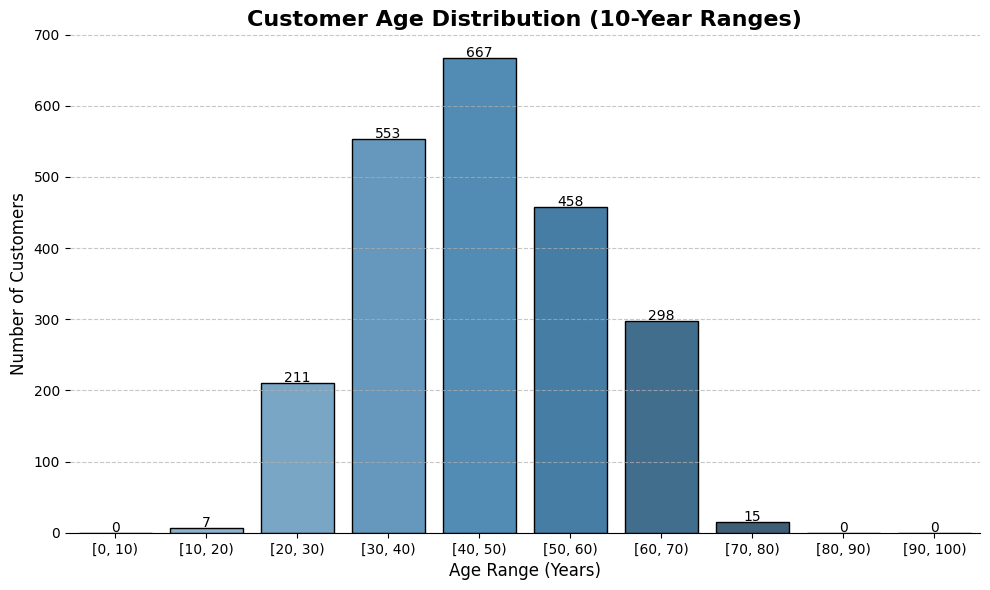
  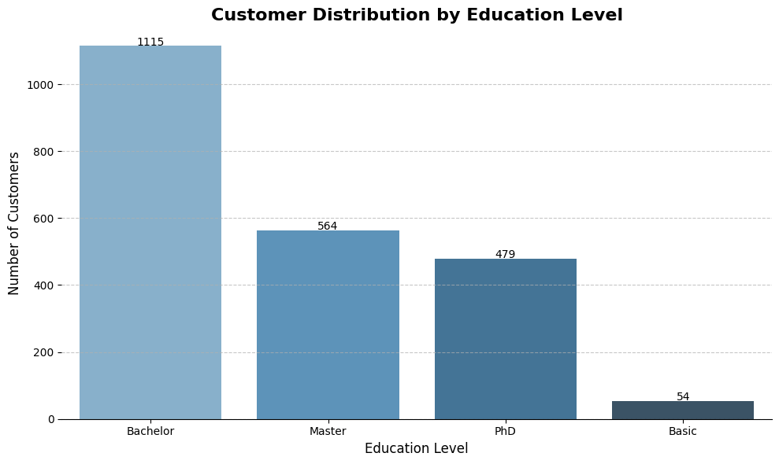
  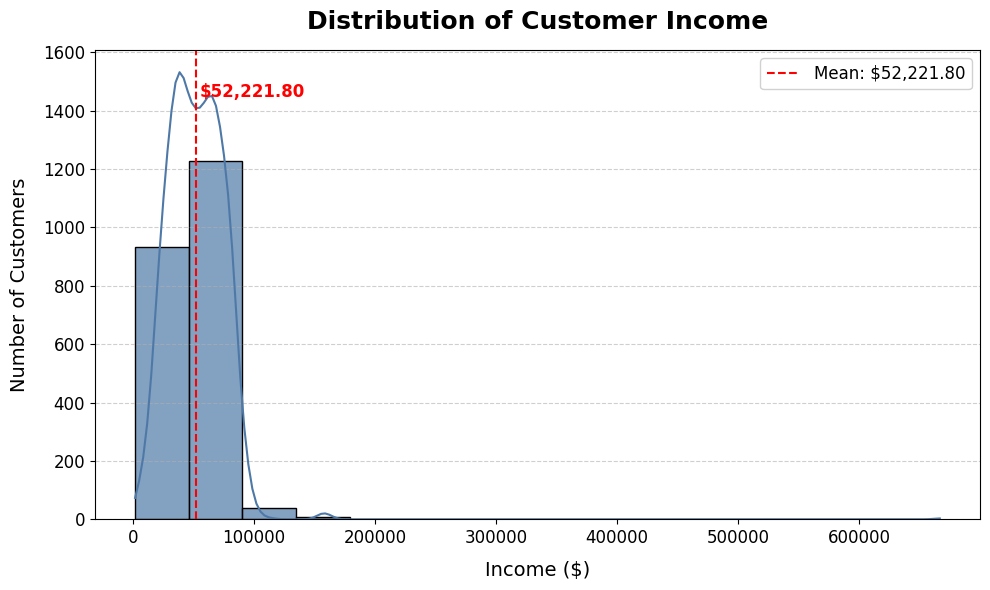
  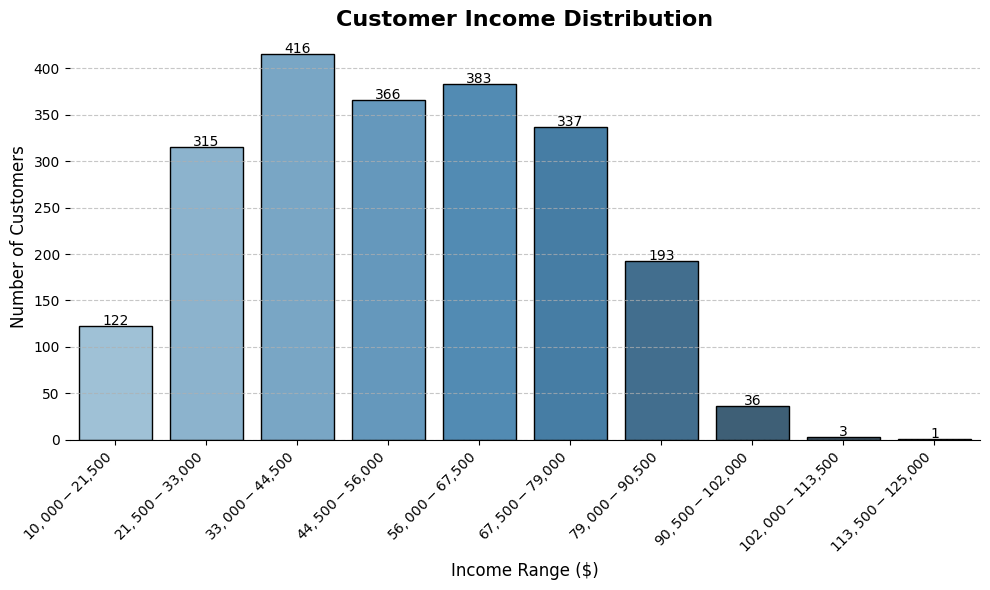
  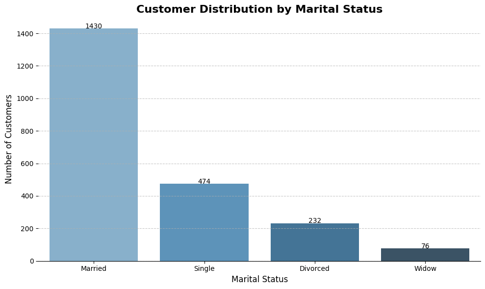
  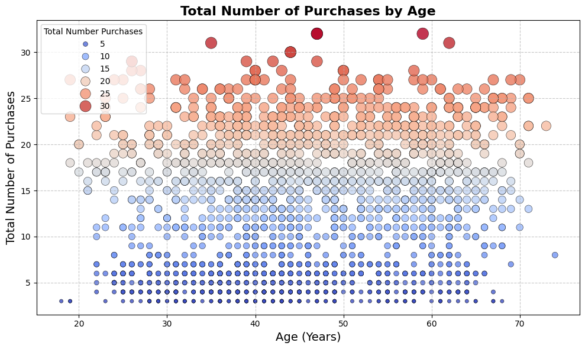

**Analysis of Customer Data**

- **Objective:** To understand key factors related to customer demographics, such as marital status, education level, income level, and total purchases.

- **Visualizations:**
  - **Bar Chart Plots:** To understand customers demographics  and behavioral traits.

#### **Audience:**

- Marketing team and Data Scientists.

 

---
### **Part 2 of the Project: Segmenting Customers into groups**

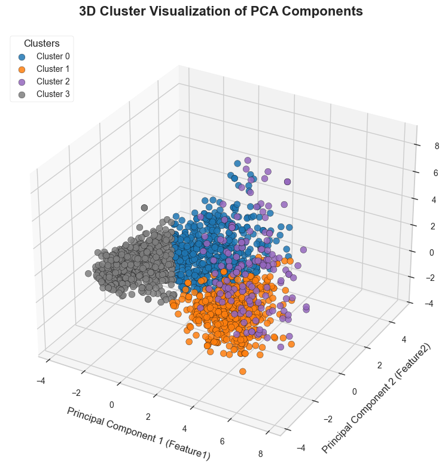

#### **Segmentation or clustering customers in groups:**  
Grouping customers based on similar traits and shared characteristics such as income, age, spending, …etc., and since we did not know what the best combinations are, we used unsupervised method to analyze the data and cluster customers in groups.

- **Objective:** To visualize the clusters or groups of the customer. The goal is to group customers with shared characteristics and traits.
- **Insights:** By analyzing the dominant features within each cluster and each feature contribution in each cluster, we gain insights into the key characteristics that define each group:
    -    Feature 1's top 3 influential variables are 'Income', 'NumCatalogPurchases', and 'MntMeatProducts'
    -    Feature 2's top 3 influential variables are 'Teenhome', 'NumDealsPurchases', and 'NumWebPurchases'
    -    Feature 3's top 3 influential variables are 'AcceptedCmp4', 'Response', 'AcceptedCmp2'

#### **Audience:**

- Marketing team and Data Scientists.

#### **Visualization:**

  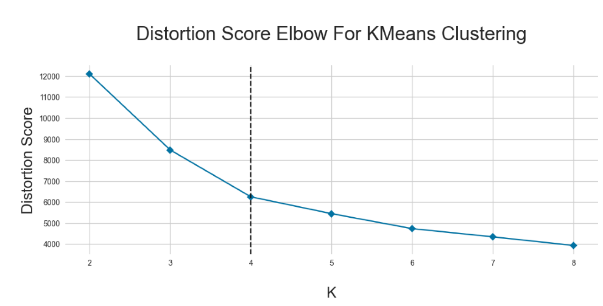
  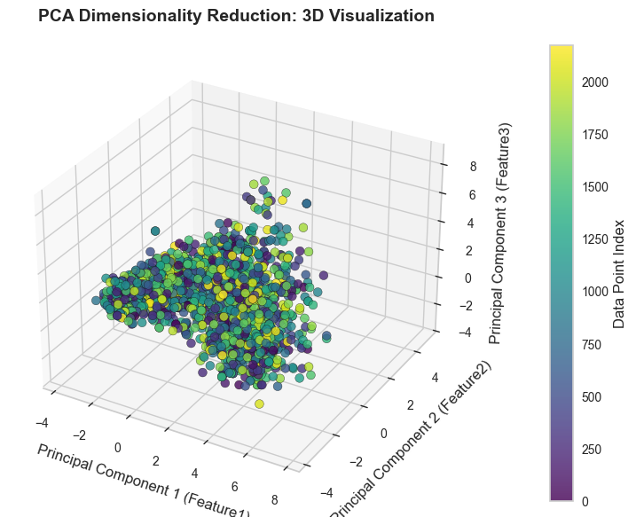
  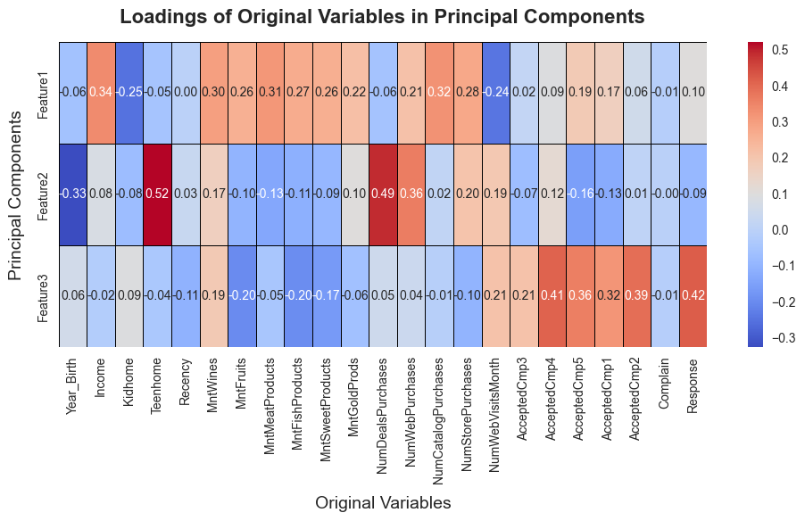  
  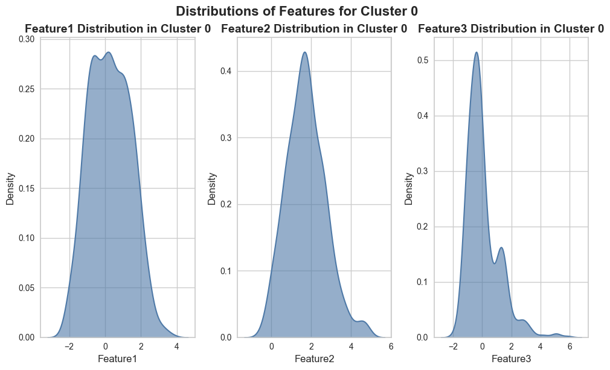
  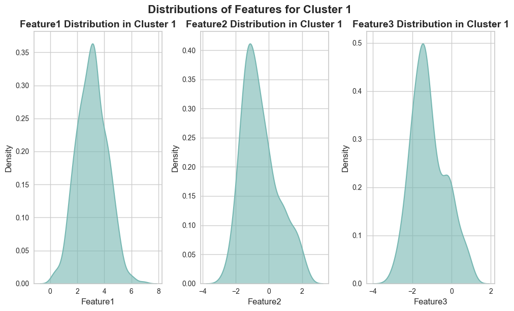
  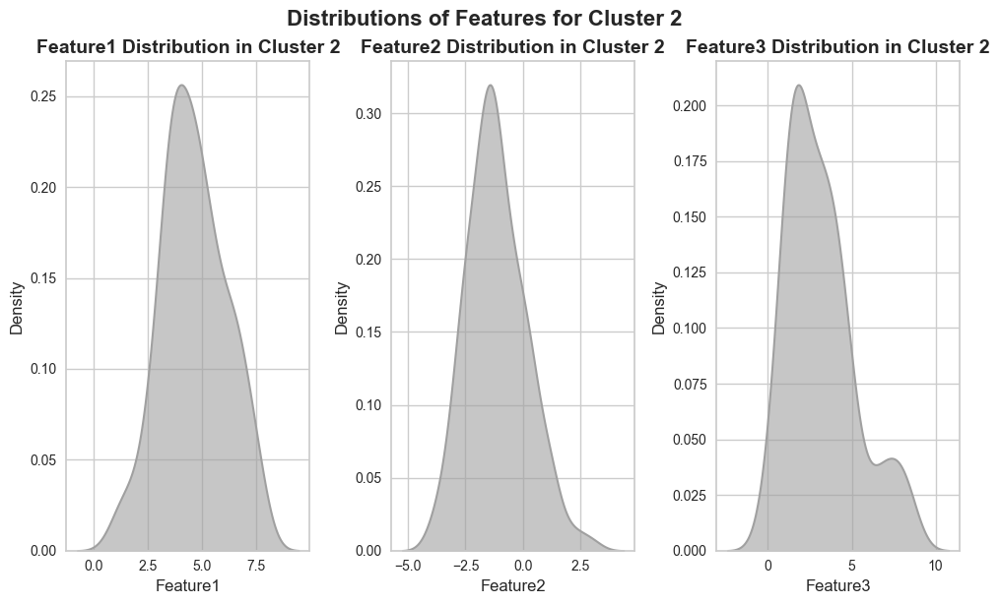
  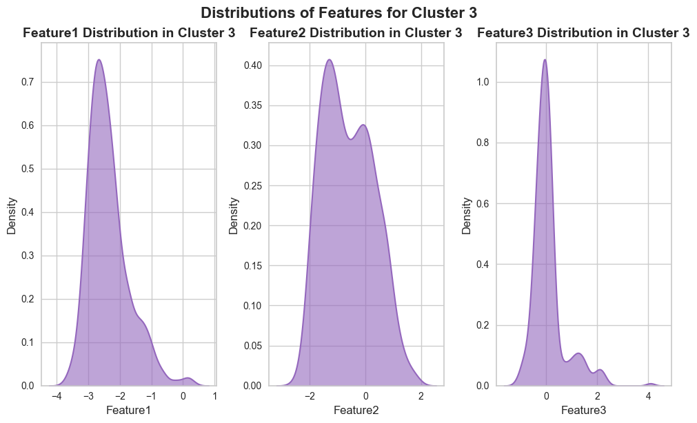
  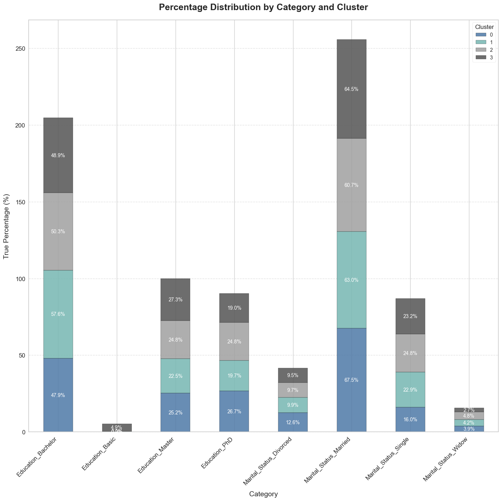
  
 

- **Line plot:** Using Elbow method to determine the optimal number of customer groups/clusters.
- **3D plot:** To Visualize the clusters(groups) of customers.
- **Correlation Heatmap Analysis plot** A powerful visualization tool to show relationships between different variables and their influence on each feature
- **Density plot:** To Visualize the Density of each feature in each clusters of customers.

 

---

### **Part 3 of the Project: Analysis of Customer groups**

#### **Detailed Interpretation of Relationship between clusters and original features (Income, Marital Status, Education, ...etc.)**

  Developed using Python with Seaborn by matplotlib, this Seaborn offers easy to plot rich graphs with information and relationships.

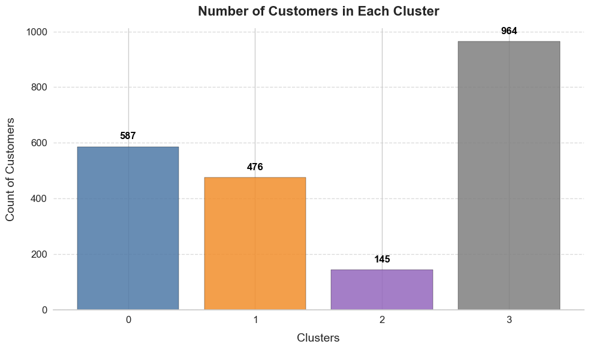

- **Number of customers in each cluster**  
  - **Observations:** \
      The number of data points in each cluster varies significantly:
       - Cluster 0 has the largest size with 999 data points.
       - Cluster 1 is the smallest with 142 data points.
       - Clusters 2 and 3 have 479 and 581 data points, respectively.
  - **Insights:**-
       - Cluster 0: Likely represents a broad group of customers with common or average characteristics.
       - Cluster 1: Represents a niche segment, possibly an outlier group or a specialized demographic.
       - Cluster sizes suggest different levels of customer importance or distinctiveness.

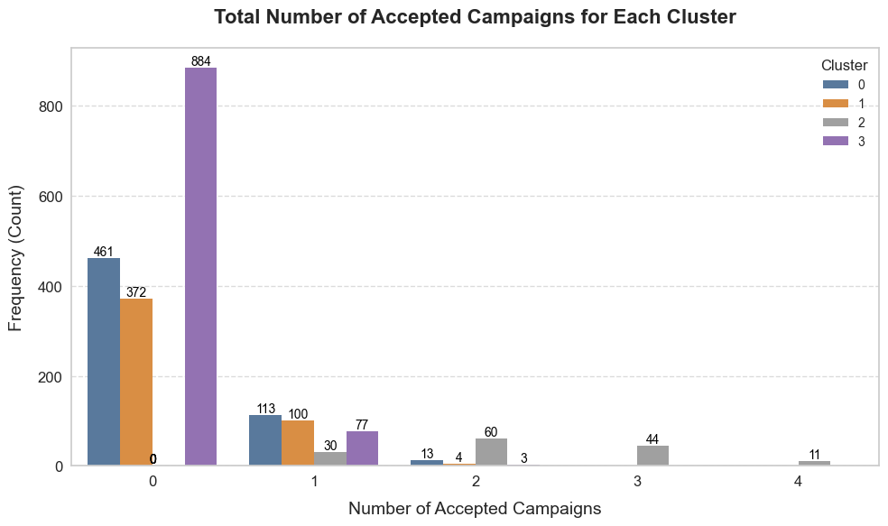

- **Total Number of Accepted Campaigns for Each Cluster**  
  - **Observations & Insights:** \
        - Cluster 0 has the highest number of individuals with "0 Accepted Campaigns," suggesting this group is the least responsive. \
        - Cluster 1 is the most engaged group, with the highest representation in 2, 3, and 4 accepted campaigns. \
        - Clusters 2 have high counts in "0 Accepted Campaigns," indicating disengagement. \
        - Clusters 3 have high counts in "0 Accepted Campaigns," indicating disengagement. \
        - Cluster 3 has the highest number of individuals accepting exactly 1 campaign, indicating a small but significant level of engagement.

- **Family Sizes in Each Cluster**  
  - **Observations & Insights:** \
        -     Cluster 0 leads in meduim family sizes (3 members) and small family size of (1 to 2) members (Small to Meduim Families)\
                     &nbsp;&nbsp;&nbsp;&nbsp;&nbsp;&nbsp;-   Consider offering bundles tailored to 2–3-member families. \
        -     Cluster 1 most in small family size of (1 to 2) members (Small Families) \
                  &nbsp;&nbsp; &nbsp;&nbsp; &nbsp;&nbsp;-     Target single individuals with individual-focused offerings, such as single-serve products \
        -     Cluster 2 leads in small family size of (1 to 2) members (Small Families) \
                  &nbsp;&nbsp;  &nbsp;&nbsp; &nbsp;&nbsp;-     Target single individuals with individual-focused offerings, such as single-serve products \
        -     Cluster 3 leads in large family sizes (4–5 members) and meduim family size of 3 members (Meduim to Larg Families) \
                   &nbsp;&nbsp; &nbsp;&nbsp; &nbsp;&nbsp;-     Tailor campaigns for medium and large families, such as family bundles, home appliances, or family-oriented services.

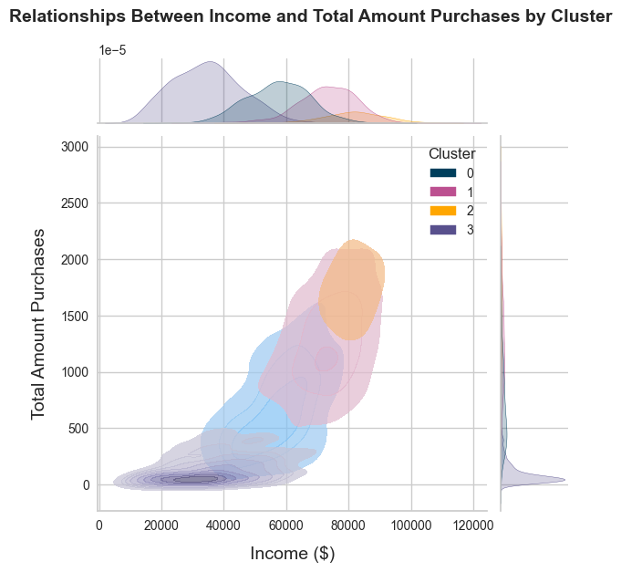

- **Relationships Between Income and Total Amount Purchases by Cluster**  
  - **Observations & Insights:** \
  &nbsp;&nbsp; - Cluster 0 (Red):
    -    Concentrated in the low-income range (up to $40,000).
    -    Total purchases are minimal, mostly below 500.
    -    Represents a low-income, low-spending group.
    - **Engage Cluster 0 with budget-friendly strategies**

 &nbsp;&nbsp; - Cluster 1 (Blue): \
    -    Located in the middle-income range ($50,000–$80,000). \
    -    Total purchases range between 500 and 1,500, indicating moderate to high spending. \
    -    Represents a mid-income, high-spending group.
    
  &nbsp;&nbsp; - Cluster 2 (Green): \
     -    Distributed in the upper-middle-income range ($70,000–$100,000). \
     -    Total purchases range from 500 to 2,000, suggesting higher spending. \
     -    Represents a mid-income, high-spending group. \
     -    **Target Cluster 2 for premium offerings**

 &nbsp;&nbsp;- Cluster 3 (Pink): \
     -    Located in the low-mid-income range ($50,000–$90,000). \
     -    Total purchases are distributed between 500 and 1,500, indicating moderate spending. 

## Cluster Profiling and Actionable Marketing Recommendations:
##### **Cluster 0 - Profile: Traditional Married Budget-Conscious Families
* Marital Status: Predominantly married.
* Education: Bachelor’s or basic education.
* Income: Low-income bracket.
* Spending: Low-spending behavior.

**Suggested Marketing Strategy for Cluster 0:** 
* Product Bundling: Create family-friendly bundles that offer discounts on grocery items, home essentials, or child-centric products. For instance, “Back-to-School Kits” or “Family Movie Night Packages.”
* Community Engagement: Organize family-oriented community events, such as free workshops or kids’ activity days, where your brand can subtly integrate its products.
* Referral Incentives: Offer discounts or cash-back rewards for referring other family members or friends to your brand.
* Digital Accessibility: Introduce user-friendly apps or platforms with budgeting tools, family planners, or discounts tailored to families’ needs.
* Localized Promotions: Work with local stores or community centers to provide hyper-localized offers that appeal to traditional family setups.

##### Cluster 1 - Profile: Educated Singles & Widowed Professionals
* Marital Status: Diverse mix of singles, married, and widowed individuals.
* Education: Higher education levels (master’s and PhD).
* Income: Moderate-income level.
* Spending: Mid-tier spending group.

**Suggested Marketing Strategy for Cluster 1:** 
* Professional Development: Offer packages focused on certifications, skill upgrades, and networking events. Partner with platforms like LinkedIn or online learning hubs for joint promotions.
* Personalized Experiences: Introduce customizable products or services, such as tailored skincare routines or custom-designed office setups.
* Luxury Sampling: Provide free samples or trials of premium products, enticing them to convert to long-term customers.
* Upsell Wellness Programs: Highlight wellness retreats, mindfulness apps, or self-care subscriptions targeting personal growth.
* Cross-Collaborations: Collaborate with professional organizations or alumni networks for exclusive offers targeting professionals looking to upskill.

##### Cluster 2 - Profile: Educated Married High Earners
* Marital Status: Predominantly married professionals.
* Education: Bachelor’s and master’s degrees.
* Income: High-income bracket.
* Spending: Consistently high spenders.

**Suggested Marketing Strategy for Cluster 2:** 
* Exclusive Memberships: Offer VIP membership programs with added benefits, such as free delivery, premium packaging, or exclusive discounts on luxury products.
* Family-Centric Luxury: Highlight high-quality, long-lasting family products, such as educational tech devices for children, luxury travel packages, or eco-friendly home appliances.
* Event Sponsorships: Sponsor family-friendly upscale events, such as wine tastings, tech fairs, or educational workshops, to create a high-value association with your brand.
* Premium Subscription Services: Launch subscription boxes featuring curated items like artisanal goods, gourmet snacks, or home décor, delivered monthly.
* Smart Home Integration: Collaborate with smart home brands to introduce exclusive deals on connected devices that align with their modern lifestyle.

##### Cluster 3 - Profile: Urban Educated Singles
* Marital Status: Mostly single individuals.
* Education: Bachelor’s and PhD holders dominate this cluster.
* Income: Middle-to-upper-middle income.
* Spending: Moderate to high spenders.

**Suggested Marketing Strategy for Cluster 3:** 
* Experience Marketing: Promote experiential products or services, such as VR gaming setups, co-working spaces, or exclusive access to events like concerts or exhibitions.
* Digital Exclusivity: Use digital marketing strategies like flash sales, early-access offers, or influencer-led campaigns to align with their fast-paced, tech-savvy lifestyle.
* Subscription Models: Provide subscriptions for lifestyle services, such as premium gym memberships, food delivery plans, or streaming platforms.
* Sustainability Appeal: Highlight eco-friendly products, such as reusable travel kits or sustainable fashion, to cater to their likely environmental awareness.
Gadget and Tech Enthusiasm: Market premium gadgets (headphones, smart devices) with a focus on sleek design and cutting-edge technology.

##### Overall
1. Omnichannel Presence: Use digital platforms for Cluster 3 while maintaining traditional marketing approaches for Cluster 0. Personalized campaigns for Clusters 1 and 2 could perform well in hybrid models combining digital and offline channels.
2. Product Differentiation: Offer clearly segmented products to address the unique needs of each cluster, ensuring that overlaps between segments (e.g., Cluster 1 and Cluster 3) are minimal.
3. Loyalty Ecosystem: Develop a unified loyalty program with tiered benefits for each cluster. For example, Cluster 0 can earn points on value purchases, while Cluster 2 gets concierge services.
4. Data-Driven Customization: Use insights from spending behaviors and preferences to drive real-time personalized offers across e-commerce platforms, boosting conversion rates.
5. Collaborative Opportunities: Partner with external organizations such as universities, family brands, or tech companies to create collaborative campaigns that expand the reach across clusters.

## Video Links

- [Bashar Nusir]()
- [Carlos fuentes] ()
- [Minsang Kim] (https://www.loom.com/share/a4aec0e1064d49dfac74b83d936a2fda)
- [Priyank Srivastava] ()
- [Yibin Wang]

## Sources and references utilized for this project 
  - [Data folder](./data/)
  - [Source Code](./src/)
  
 
